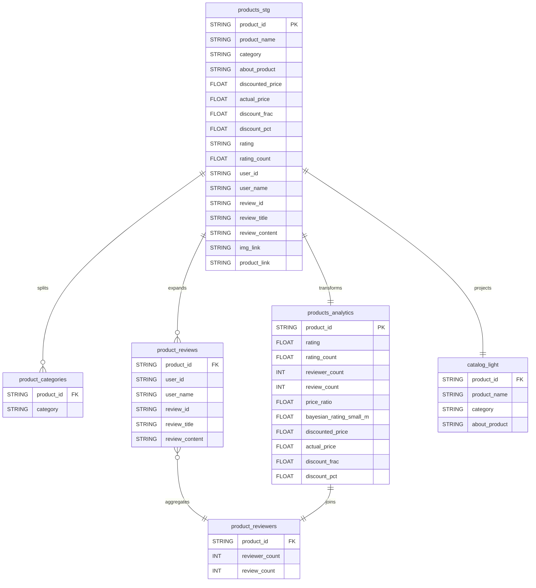

# AMAZON COMMAND SYSTEM (ACS)
**Amazon 데이터셋 기반 SQL-Only 추천 시스템**

> 고객이 “싸고 좋은 것”을 더 빨리 찾도록, **BigQuery + 순수 SQL만으로** 데이터 정제 → 분석 팩트 구축 → 5가지 추천 모듈을 제공합니다. 도메인 가정 없이 **가격 일관성**과 **품질/평점/리뷰**를 동시에 고려하도록 설계했습니다.

---

## 목차
- [프로젝트 개요]
- [데이터셋]
- [아키텍처 & 데이터 모델]
- [테이블 생성 SQL]
  - [1) products_stg]
  - [2) product_categories]
  - [3) product_reviews]
  - [4) product_reviewers]
  - [5) products_analytics]
  - [6) catalog_light]
- [추천 모듈 (5종)]
- [출력 컬럼 가이드]
---

## 프로젝트 개요
- **목표**: Amazon 리뷰/가격 정보를 기반으로 한 **설명 가능(Explainable)** 추천 시스템의 기초 설계 및 구현.
- **특징**
  - **SQL Only**: ETL/전처리부터 추천 로직까지 전부 SQL로 재현.
  - **신뢰성 우선**: 평점과 리뷰 수를 함께 반영해 소수 표본의 과대평가를 **완화(베이지안 스무딩)**.
  - **가격 타당성 체크**: `price_ratio = discounted_price / actual_price`로 **이상치 제거**.
  - **카테고리 멀티라벨** 지원: `A|B|C`를 태그로 분해해 카테고리 Top-N 산출.
  - **현실적 시나리오** 5가지: 오늘의 특가, 카테고리 Top-5, 가성비 큐레이션, 유사 가격대 대안, 예산 내 최적.

---

## 데이터셋
- **Amazon Sales Dataset (Kaggle)**  
  1K+ 상품의 평점/리뷰 및 가격 정보(상품/카테고리/할인/평점/리뷰/이미지/링크 등).

**전처리 포인트**
- `category`는 `A|B|C` 파이프 구분자 → 공백 제거 후 태그로 분해.
- 리뷰 5개 컬럼(`user_id`, `user_name`, `review_id`, `review_title`, `review_content`)은 쉼표 기준 길이 불일치 가능 → 공백 표준화 + `SPLIT` + `SAFE_OFFSET`로 안정 전개.
- `discount_percentage`를 **`discount_frac`(0~1)**, **`discount_pct`(0~100)**로 분리.
- `rating_count`의 `'nan'` 문자열 처리 및 수치형 변환.

---

## 아키텍처 & 데이터 모델
BigQuery 상에서 아래 **6개 테이블/브릿지**를 만듭니다.

## 추천 모듈 (5종)
### 1) Modu Box: 오늘의 특가(품질 보장)

**아이디어: 큰 할인율 + 최소 품질선(평점 ≥ 3.5) + 실제 리뷰 존재**
### 2) 카테고리별 Top-5 (멀티라벨)

**아이디어: 태그 내에서만 공정 비교(품질→표본→할인 순 정렬, 결정적 타이브레이크)**

### 3) 가성비 큐레이터 (숨은 고평점, 소수 리뷰)

**아이디어: 리뷰 1–5개지만 평점이 높은 상품을 가격 이상치 제거 후 발굴**

### 4) 비슷한 가격대의 상위 대안 (상세페이지 대체 제안)

**아이디어: 같은 leaf 카테고리에서 ±20% 가격대 안에 있으면서 품질이 같거나 더 좋은 후보**

### 5) 예산 내 상위 품질 제품 (≤ 200 예시)

**아이디어: 평점+리뷰(신뢰도)+할인율을 묶은 하이브리드 점수로 예산 내 Top-20**

## 출력 컬럼 가이드

- **price_ratio** : discounted_price / actual_price (0 < ratio ≤ 1) → 가격 이상치 필터링에 사용

- **bayesian_rating_small_m** : 평점과 표본 크기를 함께 고려한 보정 평점

- **quality** : COALESCE(bayesian_rating_small_m, rating)로 보정 우선, 원평점 대체

- **score_hybrid** : (평점 + 0.05 × 리뷰수) × (1 + 0.2 × 할인율) → 설명 가능한 가성비 점수
